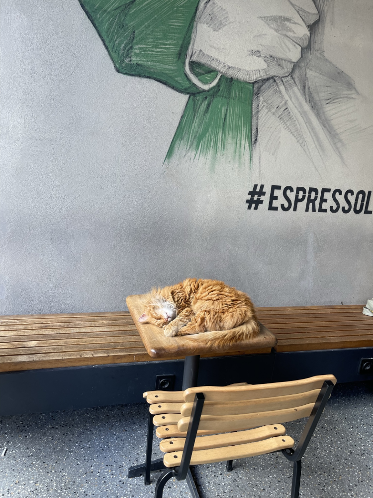

# strays-of-istanbul 🐈🐕
The source for the [strays-of-istanbul.xyz](https://strays-of-istanbul.xyz) website. Nothing too fancy, just a static website, with bare-minimum CSS and JS and that just shows a bunch of cat images. I call it simplicity... not that I have no idea how to make a website 🤫

## Hosting
The domain is pointing to an S3 bucket that is serving the static HTML (`index.html`) file. The assets are also stored there for simplicity and ease of access and use.

## Media
All of the photos have been shot on my iPhone 12 Pro Max. The only editing that has been done to them is to convert them to WEBP to save some some bandwitdth. However, the website will fallback to JPGs if a user visits using their microwave.

    

